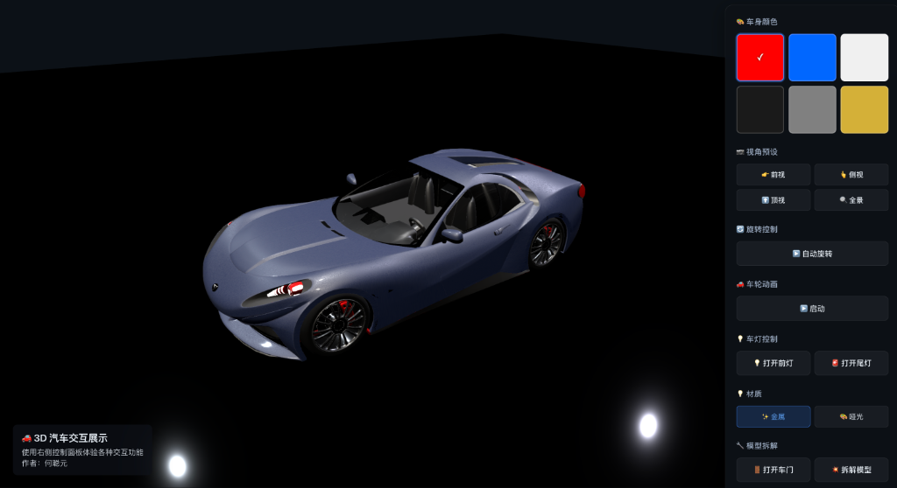

# 3D 汽车交互展示 (3D Car Showcase)

基于 **Vue 3** + **Three.js** 开发的高保真 3D 汽车可视化交互项目。支持实时换色、视角切换、车灯控制及模型拆解等丰富功能。



## ✨ 功能特性 (Features)

- **🎨 车身颜色定制**：支持多种车漆颜色实时切换（红、蓝、白、黑、灰、黄）。
- **🎥 视角控制**：
  - 提供前视、侧视、顶视、全景等多种预设视角。
  - 支持自动旋转展示。
- **💡 灯光系统**：可交互控制前大灯和尾灯的开关。
- **🏎️ 动画演示**：支持车轮转动动画（启动/停止）。
- **🛠️ 模型交互**：
  - **车门控制**：支持开启/关闭车门。
  - **模型拆解**：支持爆炸图模式，展示汽车内部结构。
- **✨ 材质切换**：支持金属与哑光等不同材质质感切换。

## 🛠️ 技术栈 (Tech Stack)

- **核心框架**: [Vue 3](https://vuejs.org/)
- **构建工具**: [Vite](https://vitejs.dev/)
- **3D 引擎**: [Three.js](https://threejs.org/)
- **开发语言**: TypeScript

## 🚀 快速开始 (Getting Started)

### 环境要求

- Node.js (推荐 v16+)
- npm 或 yarn

### 安装

1. 克隆项目到本地：
   ```bash
   git clone <repository-url>
   ```

2. 进入项目目录并安装依赖：
   ```bash
   cd 3D-car
   npm install
   ```

### 开发

启动本地开发服务器：

```bash
npm run dev
```

### 构建

```bash
npm run build
```

## 📄 许可证

本项目仅供学习和练习使用。

## 👤 作者 (Author)

- **微信**: hecongyuan2025


```
